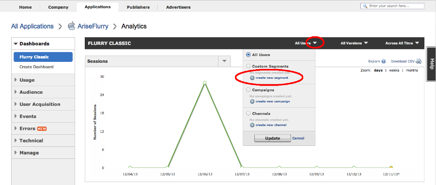
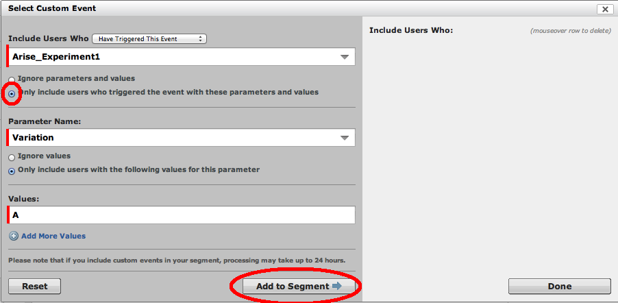
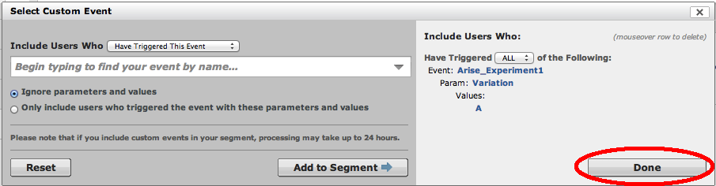
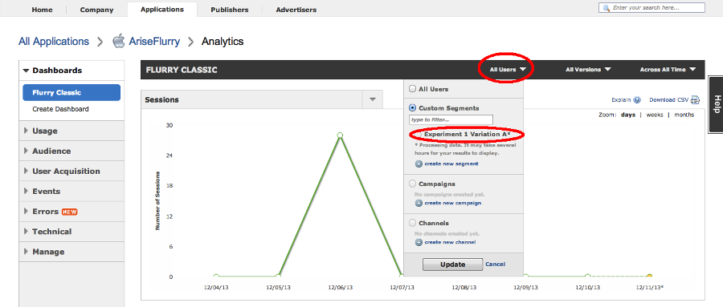

.. meta::
   :description: Flurry Analytics integration

Flurry Analytics integration
***************************************************

This document will help you to integrate Arise with your Flurry account.

Introduction
==================
If you use Flurry to measure your app traffic, you can now see Arise data alongside the rest of your Flurry data. Arise will push its data to Flurry directly from the mobile app. You will then be able to segment any Flurry report by experiment variation. Integrating Arise with Flurry will let you compare two variation using advanced metrics provided by Flurry.

Implementation instructions
=============================

1. Add Flurry to your project
----------------------------------------

Follow the Flurry Analytics `Getting started tutorial`_. This tutorial will help you to install Flurry in your application.

.. _Getting started tutorial: http://support.flurry.com/index.php?title=Analytics/GettingStarted

2. Activate Flurry reporting from Arise
----------------------------------------

Right after the initializeWithKey method, call enableFlurry to enable Arise to report its events to Flurry.

On iOS:

.. code-block:: obj-c

    [Arise initializeWithKey:@"9c51b5e8f06ebd26728f29954365098f052c68c8" appName:@"AngryElephants"];
    [Arise enableFlurry];

On Android:

.. code-block:: java

    Arise.initialize(getApplicationContext(), "9c51b5e8f06ebd26728f29954365098f052c68c8", "AngryElephants");
    Arise.enableFlurry();

Arise will send custom events with experiments and variations data to Flurry.

3. Segment your data in Flurry
-------------------------------

Flurry might take up to a day to show events data. An event is a view or a conversion. For each event, a Type ("View" or "Conversion") and a Variation ("A" or "B") is attached. As an example, we are going to segment our users for the Variation A and Variation B of the Experiment1.

In Dashboards -> Flurry Classic, click on All users and the top and select create new segment.

Click on Add Custom Event

.. image:: _static/create_segment.png

- Enter Arise_Experiment1 for the name of your event (select it from the drop down menu).
- Select the "Only include users who triggered the event with these parameters and values" option.
- Select "Variation" as Parameter Name
- Select the "Only include users with the following values for this parameters" option
- Enter "A" as a value

Click on the "Add to Segment" button.

Click on the "Done" button. At the bottom of the Create Segment panel, enter "Arise Experiment 1 Variation A" as segment name and click on "Create this segment".

Repeat all the step above to add a segment for each variation of your experiment.

4. Analyze your users behavior
-------------------------------

Flurry usually takes around 48 hours before reporting events. To view all the Flurry metrics for one variation, click on "All Users" at the top of the page and select your experiment variation in the Custom Segment section.

