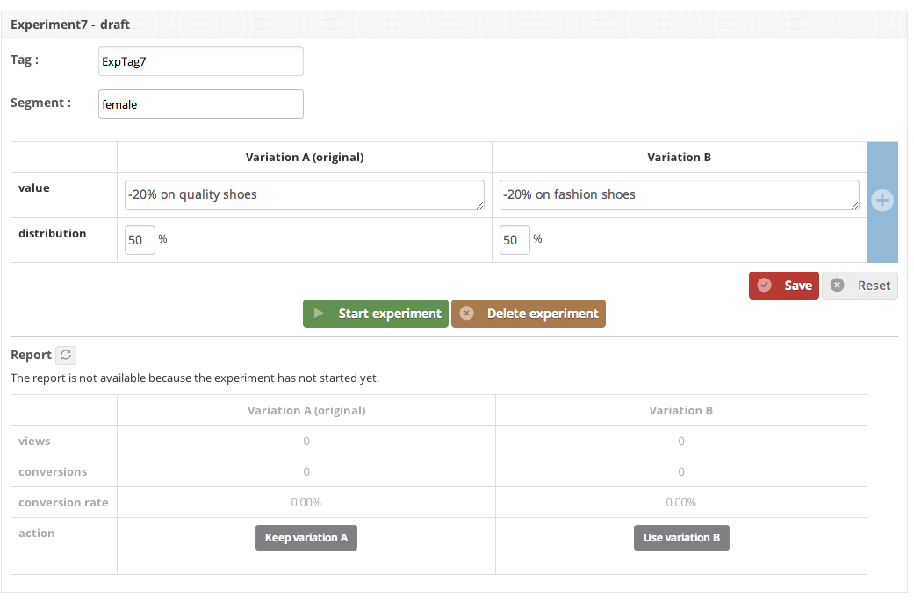

.. meta::
   :description: Defining Segments

Segmentation
***************************************************

This document will help you to understand, define and integrate segments.

Introduction
==================
Segmentation helps you to run an experiment only on a segment of a population. A "Dimension" is a key concept in segmentation. A dimension is a characteristic of your population. For example the gender is a characteristic of a population. A dimension is divided into multiple segment. For example the "genre" dimension is divided between "male" and "female".
Arise can help you segment your users for a single dimension. Arise do not support yet multiple dimensions. Few examples of dimensions that can be implemented:

* genre
* location
* already a buyer
* etc.

You have to define the segment value of the dimension using the Arise SDK. On the dashboard you will be able to run your experiment only on a specific segment. For example, you can set the gender value with the Arise SDK (male or female) then run an experiment only on the female segment to test a new promotion.

Implementation instructions
=============================

1. Define the segment value
----------------------------------------

Add the segment parameter to the initialize method. In this example we set the segment value for the genre. The segment value should be retrieve for the info

On iOS:

.. code-block:: obj-c

    [Arise initializeWithKey:key appName:appname setSegment:@"female"];

On Android:

.. code-block:: java

	Arise.initialize(getApplicationContext(), authKey, appName, "female");

2. Segment your experiment
----------------------------------------

On your dashboard, you can enter the segment value for the experiment. If you want to run the experiment only on females, just enter "female" in the Segment input box. Other segment(s) will not be part of the experiment and will display a default value. Events of users not in the experiments will be also ignored.

